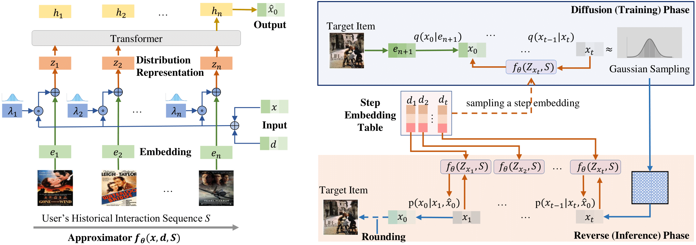

# DiffuRec

This is a PyTorch implementation for our [DiffuRec](https://arxiv.org/abs/2304.00686) paper:

> Zihao Li, Aixin Sun, and Chenliang Li. 2023. DiffuRec: A Diffusion Model for Sequential Recommendation. ACM Trans. Inf. Syst. 42, 3, Article 66 (May 2024), 28 pages. https://doi.org/10.1145/3631116

## Overview
Mainstream solutions to Sequential Recommendation (SR) represent items with fixed vectors. These vectors have limited capability in capturing items’ latent aspects and users' diverse preferences. As a new generative paradigm, Diffusion models have achieved excellent performance in areas like computer vision and natural language processing. To our understanding, its unique merit in representation generation well fits the problem setting of sequential recommendation. In this paper, we make the very first attempt to adapt Diffusion model to SR and propose DiffuRec, for item representation construction and uncertainty injection. Rather than modeling item representations as fixed vectors, we represent them as distributions in DiffuRec, which reflect user's multiple interests and item's various aspects adaptively. In diffusion phase, DiffuRec corrupts the target item embedding into a Gaussian distribution via noise adding, which is further applied for sequential item distribution representation generation and uncertainty injection. Afterward, the item representation is fed into an Approximator for target item representation reconstruction. In reverse phase, based on user's historical interaction behaviors, we reverse a Gaussian noise into the target item representation, then apply a rounding operation for target item prediction. Experiments over four datasets show that DiffuRec outperforms strong baselines by a large margin.



## Requirements
- Python 3.8.11
- PyTorch 1.8.0
- numpy 1.23.4
  
Our code has been tested running under a Linux desktop with NVIDIA GeForce RTX 3090 GPU and Intel Xeon CPU E5-2680 v3. 

## Usage

0. Clone this repo

    ```
    git clone https://github.com/WHUIR/DiffuRec.git
    ```

2. You can run the below command for model training and evaluation.
    ```
    python main.py --dataset amazon_beauty
    ```

## Citation
Please cite the following paper corresponding to the repository:
```
@article{10.1145/3631116,
author = {Li, Zihao and Sun, Aixin and Li, Chenliang},
title = {DiffuRec: A Diffusion Model for Sequential Recommendation},
year = {2023},
issue_date = {May 2024},
publisher = {Association for Computing Machinery},
address = {New York, NY, USA},
volume = {42},
number = {3},
issn = {1046-8188},
doi = {10.1145/3631116},
journal = {ACM Trans. Inf. Syst.},
}
```

## Acknowledgements

[TimiRec](https://github.com/THUwangcy/ReChorus/tree/CIKM22), [SVAE](https://github.com/noveens/svae_cf), [ACVAE](https://github.com/ACVAE/ACVAE-PyTorch) and [STOSA](https://github.com/zfan20/STOSA).
